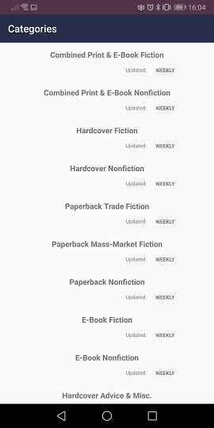
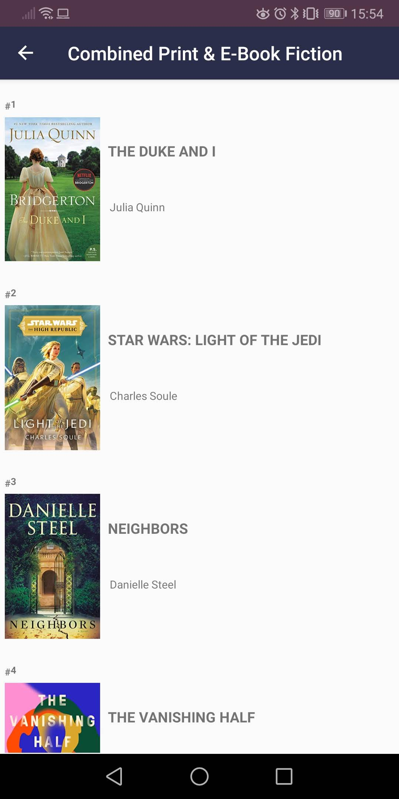
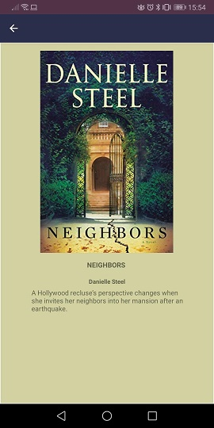
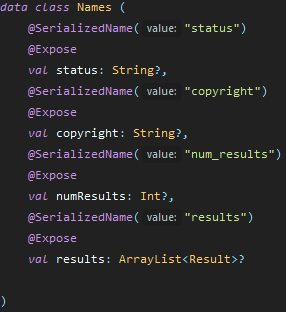
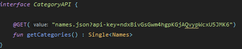
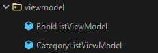
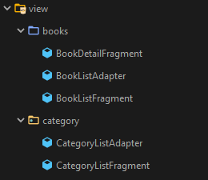

# TopBooks
Android app written in Kotlin, that shows best selling books from the NY times API.
The app uses a RecyclerView List that shows categories that are retrieved from the API, on a selected category the best selling books are showed. A detail screen is available for every book. 

## About
I created this app as a summer project to learn about android development. 
This project has taught me how to use an architecture pattern to develop an app, how to use various android libraries and has given me surface knowledge on dependancy injection and unit testing.

## Tech 
The app uses:

• MVVM arhitecture pattern to structure the code base

• Android jetback libraries

• Retrofit for remote api calls 

• Glide for image processing

• Dagger2 for dependancy injection and Mockito for unit testing.

# App screenshots

  

# MVVM 
MVVM is an architectural patterns that which uses seperation of concerns. It allows the seperating of UI logic from the business logic

## Model
The model represents the data logic of the app. 

 

It holds the classes for data classes and api calls.

  

## ViewModel
The ViewModel acts as a link/connection between the Model and View. The ViewModel interacts with the Model and prepares obserevables that can be observed by the View.

## View
The View is used to observe ViewModels obersavables and update the UI elements accordingly.

