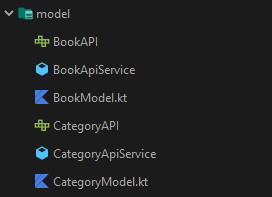

# TopBooks
Android app that shows best selling books from the NY times API

## About
I created this app as a summer project to learn about android development. 
This project has taught me how to use an architecture pattern to develop an app, how to use various android libraries and given me surface knowledge on dependancy injection and unit testing.

## Tech 
The app uses MVVM arhitecture pattern, android jetback libraries, retrofit for remote api management, dagger2 for dependancy injection and mockito for unit testing

# MVVM 

## Model
The model represents the data classes of the app. 

